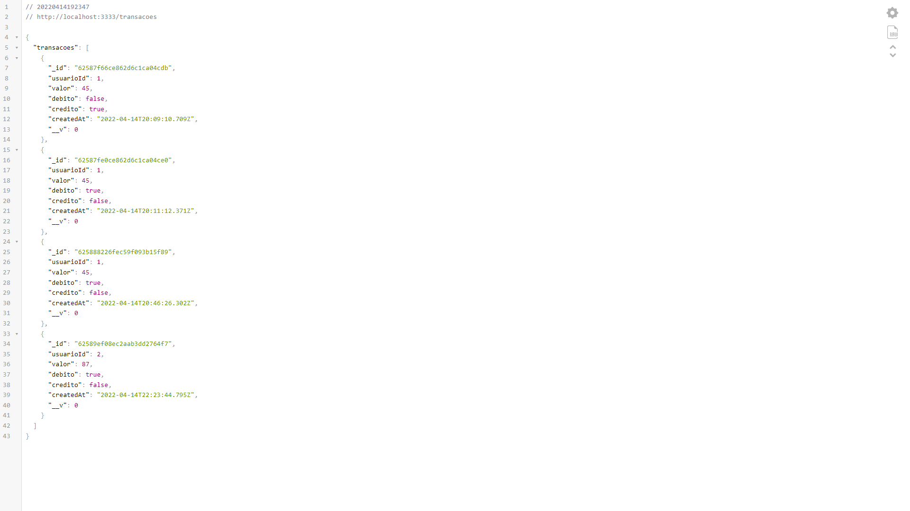
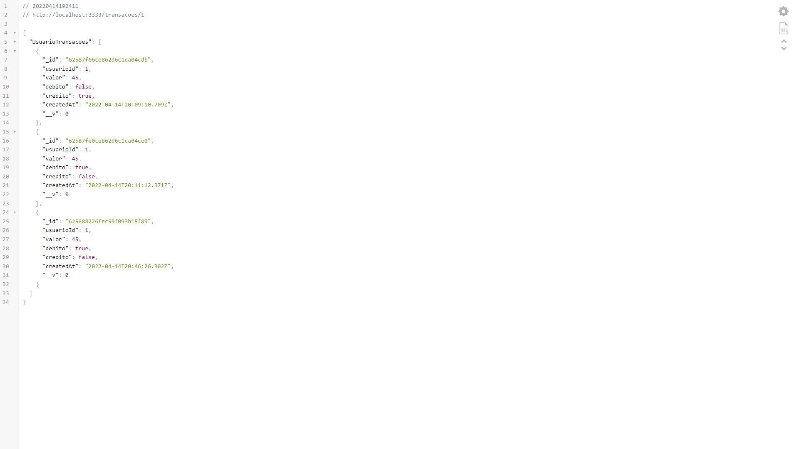
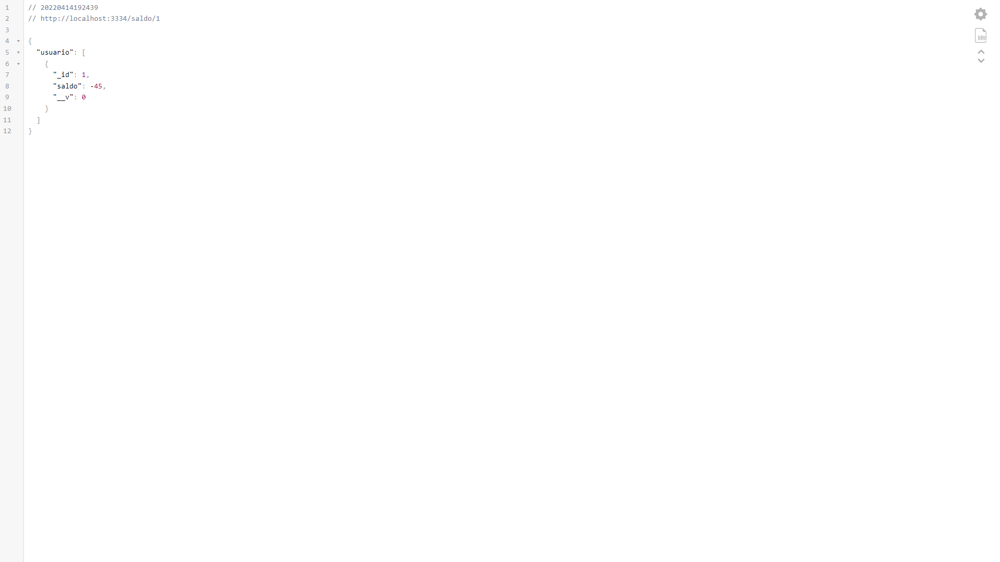

Nesse desafio eu criei uma API que recebe um objeto JSON com a id da transação, id do usuário,
valor da transação e se é débito ou crédito. Para a criação da API usei express com o mongodb
como banco de dados.

  
  

  <h1 align="center">Sobre o Projeto</h1>
  
Para realizar o desafio, criei duas API's, uma que armazena as transações e outra que armazena o saldo
    de cada usuário.
  

  
Na primeira API é armazenado um JSON no qual tem a id da transação, a id usuário, o valor da transação,
    se é débito ou crédito e a data que foi realizada; utilizei dois endpoints:
    geral, onde aparecem todas as transações que ocorreram, e individualmente, filtrando somente as que pertecem
    a id do usuário. A segunda API, por meio do axios, pega as informações das transações do usuário; com essas 
    informações faço um filtro para saber se é crédito ou débito e assim fazer o cálculo do saldo do cliente, e 
    envio para a API o id do usuário e o saldo da conta em formato JSON.
  

  
 As duas API's foram armazenadas no mongodb, porque tive dificuldade em aplicar o redis para armazenar em cache,
    fazendo com que a aplicação não seja tão performática.
  

    
    

  

  <h1 align="center">Layout das API's</h1>
    
    
    

  <h1 align="center">Tecnologias utilizadas</h1>
  <ul>
    <li>Node.js</li>
    <ul>
      <li>express</li>
      <li>Mongodb</li>
      <li>Dotenv</li>
      <li>Axios</li>
    </ul>
    <li>Typescript</li>
  </ul>

